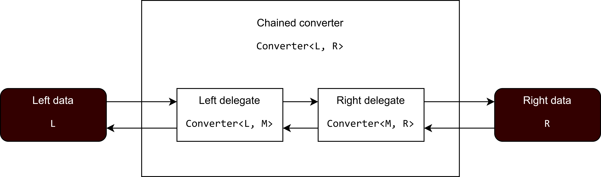
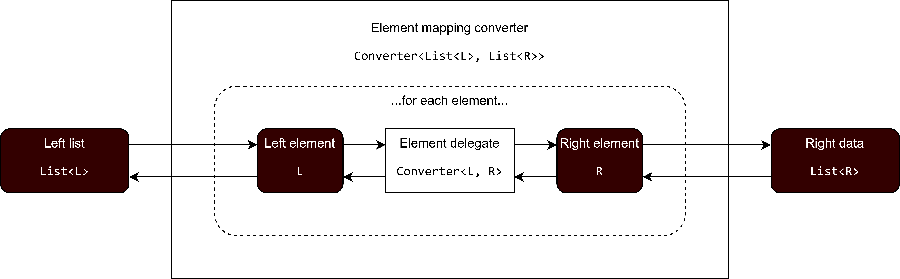

# HLL Converters

This package and subpackages provide a framework for typed data mapping, including base interfaces and some reusable
implementations. This document describes the theory behind the conversion framework and how it may be applied.

## Terminology

In the context of this library, the following terms are used:

* **Converter** — an object capable of bidirectional data mapping between two types, referred to as **left** and
  **right**. A **converter** may be implemented as two symmetrical **mono-converters**
* **Mono-converter** — an object capable of data mapping from one type into another type. A mono-converter which
  performs the _reverse_ data mapping of another mono-converter is said to be **symmetrical** to the other and vice
  versa. **Symmetrical** **mono-converters** are the typical implementation of **converters**, which would then perform
  data mapping by delegating to the appropriate **mono-converter** for the transformation direction. 
* **Left** — the name for the type on one side of a bidirectional data mapping. By convention, this is typically used to
  represent types that are closer to your application or business logic. One may think of **left** types as "my" types.
* **Right** — the name for the type on one side of a bidirectional data mapping. By convention, this is typically used
  to represent types that are farther away from your application or business logic. One may think of **right** types as
  "their" types.

## Interfaces

These two Kotlin interfaces form the basis of typed data mapping:

```kotlin
fun interface MonoConverter<A, B> {
    fun convert(from: A): B
}

interface Converter<L, R> {
    val right: MonoConverter<L, R>
    val left: MonoConverter<R, L>

    fun convertRight(from: L): R = right.convert(from)
    fun convertLeft(from: R): L = left.convert(from)
}
```

`MonoConverter` (i.e., the mono-converter [described above](#terminology)) is a generic type which maps from `A` to `B`.
`A` is the source type of the conversion (i.e., the input) while `B` is the destination type (i.e., the output).

`Converter` (i.e., the converter [described above](#terminology)) is a generic type which maps between `L` (the left
type) and `R` (the right type). Implementations are encouraged (but not required) to utilize symmetrical mono-converters
and accept the default implementations of `convertLeft` and `convertRight`. This will maximize the converter's
flexibility when used in [the composition operations described below](#composing-converters).

### Example usage

A simple converter that maps between a string and a boolean could be implemented as follows:

```kotlin
val stringToBoolean = MonoConverter<String, Boolean> { input: String ->
    when (input.lowercase()) {
        "yes", "true" -> true
        "no", "false" -> false
        else -> error("Cannot convert '$input' to Boolean!")
    }
}
println(stringToBoolean.convert("yes")) // Prints true
println(stringToBoolean.convert("maybe?")) // Throws exception

val booleanToString = MonoConverter<Boolean, String> { input: Boolean ->
    when (input) {
        true -> "yes"
        false -> "no"
    }
}

val converter = Converter(stringToBoolean, booleanToString)
println(converter.convertRight("no")) // Prints false
println(converter.convertLeft(false)) // Prints "no"
```

In the preceding code, `stringToBoolean` is a mono-converter that turns `"true"` and `"yes"` into `true` and turns
`"false"` and `"no"` into `false`. Conversely, `booleanToString` turns `true` into `"yes"` and `false` into `"no"`.
`stringToBoolean` and `booleanToString` are symmetrical (i.e., they perform the reverse mapping of each other) and so
they may be combined into a bidirectional converter.

The factory function `Converter` accepts two symmetrical mono-converters and returns a converter implementation that
delegates to them. The resulting converter uses the first argument (`stringToBoolean`) for rightward conversion and the
second argument (`booleanToString`) for leftward conversion.

## Composing converters

Sometimes data transformations are complex or share common logic with other transformations. In these cases, simpler
converters may be reused by composing them. There are two primary forms of composition:

### Chaining

Converters may be "chained" together in a series of sequential transformations. In a chain, the output of one converter
becomes the input to another:



The `+` operator is used to chain individual converters together:

```kotlin
operator fun <L, M, R> Converter<L, M>.plus(next: Converter<M, R>): Converter<L, R>
```

Note that the result of chaining two converters is itself a new converter.

This operator function introduces a new generic variable `M` which represents the **middle** data type. Because a
chained converter passes data from one delegate to the next, the joining types of the converters must be the same. In
other words, the left type of one converter and the right type of the other converter must match.

The following example shows how to combine to existing converters:

```kotlin
val shortToInt: Converter<Short, Int> = ...
val intToLong: Converter<Int, Long> = ...

val shortToLong: Converter<Short, Long> = shortToInt + intToLong
```

In the preceding example, `shortToLong` is a chained converter which converts rightward by turning `Short` into `Int`
by delegating to `shortToInt` and then turning the resulting `Int` into `Long` by delegating to `intToLong`. Conversely,
it converts leftward by turning `Long` into `Int` by delegating to `intToLong` and then turning the resulting `Int` into
`Short` by delegating to `shortToInt`.

Because a chaining operation yields a new converter, it may be further chained with more converters. For example:

```kotlin
val byteToShort: Converter<Byte, Short> = ...
val shortToInt: Converter<Short, Int> = ...
val intToLong: Converter<Int, Long> = ...

val byteToLong: Converter<Byte, Long> = byteToShort + shortToInt + intToLong
```

### Element mapping

Converters may be wrapped by a collection converter in order to transform collection elements from one type to another:



Collection converters are typically build using factory functions which accept one or more delegate converters as
arguments. For example:

```kotlin
fun <L, R> ListMappingConverter(delegate: Converter<L, R>): Converter<List<L>, List<R>>
```

The preceding function creates a converter which transforms between `List<L>` and `List<R>` by mapping over each element
and using the delegate converter to transform between element types `L` and `R`.
